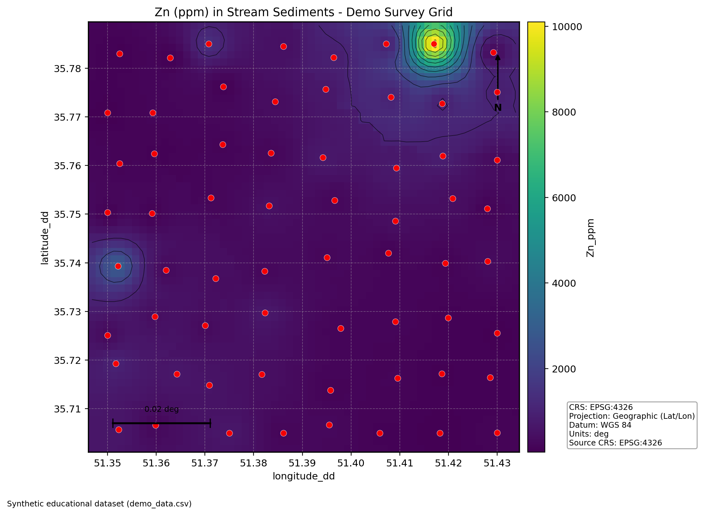
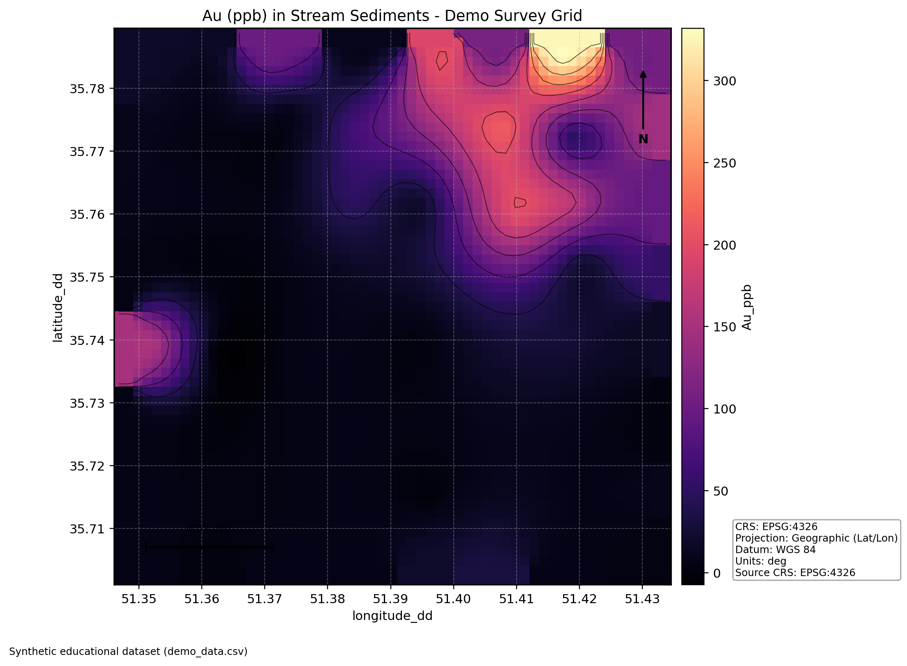

# Geochemical Mapping

MinexPy's mapping workflow is organized into four steps:

1. `prepare`: load and clean point data, apply projection, and optional value transform.
2. `create_grid`: create a regular mesh and interpolation nodes.
3. `interpolate`: estimate a continuous surface on the mesh.
4. `plot_map` / `viz`: compose a final map with cartographic elements.

## Step 1: Prepare Point Data

Use `prepare` to validate columns, coerce numeric values, drop invalid rows, and produce canonical mapping columns.

```python
import pandas as pd
from minexpy.mapping import prepare

df = pd.DataFrame(
    {
        "lon": [44.10, 44.18, 44.22, 44.05, 44.28],
        "lat": [36.55, 36.61, 36.49, 36.70, 36.64],
        "Zn": [35.0, 48.0, 42.0, 30.0, 55.0],
    }
)

prepared, meta = prepare(
    data=df,
    x_col="lon",
    y_col="lat",
    value_col="Zn",
    source_crs="EPSG:4326",
    target_crs="EPSG:3857",
    value_transform="log10",
)
```

`prepare` supports:

- `pandas.DataFrame`
- `.csv` file paths
- `.xls` / `.xlsx` file paths

Output columns in `prepared`:

- `x`, `y`: projected coordinates
- `value_raw`: original numeric concentration
- `value`: working concentration (possibly transformed)

If duplicate coordinates exist, MinexPy warns and drops duplicates (keep-first) when `drop_duplicate_coordinates=True`.

## Step 2: Create Grid

Use `create_grid` to construct the base interpolation mesh.

```python
from minexpy.mapping import create_grid

grid = create_grid(
    data=prepared,
    cell_size=200.0,
    x_col="x",
    y_col="y",
    padding_ratio=0.05,
)
```

The returned `GridDefinition` contains:

- raw extent and padded extent
- `xi`, `yi` axes
- `Xi`, `Yi` mesh arrays
- flattened `grid_points` for interpolation
- `nx`, `ny`, `n_nodes`

## Step 3: Interpolate Surface

Use `interpolate` as a dispatcher or call method-specific functions directly.

```python
from minexpy.mapping import interpolate

result = interpolate(prepared, grid, method="idw")
```

Available methods:

- `nearest`
- `triangulation` (`kind="linear"` or `kind="cubic"`)
- `idw` (`power`, `k`, `radius`, `eps`)
- `minimum_curvature` (`max_iter`, `tolerance`, `relaxation`, `mask_outside_hull`)

All methods return `InterpolationResult` with:

- interpolated surface `Z` (`ny x nx`)
- `valid_mask`
- method parameters
- convergence diagnostics for minimum curvature

## Step 4: Compose Final Map

Use `plot_map` (or alias `viz`) to build the final map figure.

```python
from minexpy.mapping import plot_map

fig, ax = plot_map(
    prepared=prepared,
    prepare_metadata=meta,
    interpolation_result=result,
    title_parts={"what": "Zn (ppm) in Stream Sediments", "where": "Area X", "when": "2026"},
    cmap="viridis",
    show_contours=False,
    show_points=True,
    show_north_arrow=True,
    show_scale_bar=True,
    show_numeric_scale=True,
    show_coordinate_grid=True,
    show_neatline=True,
    crs_info={"projection": "Web Mercator", "datum": "WGS84", "units": "m"},
    footer="Author: MinexPy User | Organization: Geo Lab | Date: 2026-02-16",
)
```

By default, `plot_map` can run the whole pipeline from raw `data` if you pass `cell_size` and column names.

### Cartographic Elements Included

- title (`title` or `title_parts`)
- colorbar legend
- north arrow
- scale bar
- numeric scale (`1:n`) for metric units
- CRS/projection/datum/zone/units block
- coordinate grid lines
- neatline (map frame)
- optional locator inset
- footer/credits text

### Mixed Input Modes

You can pass raw and precomputed stages together. Downstream precomputed objects take precedence:

1. `interpolation_result`
2. `grid`
3. `prepared`
4. raw `data`

Ignored upstream arguments produce warnings.

## Full One-Call Example

```python
import pandas as pd
from minexpy.mapping import plot_map

df = pd.read_csv("stream_sediments.csv")

fig, ax = plot_map(
    data=df,
    x_col="longitude",
    y_col="latitude",
    value_col="Zn_ppm",
    source_crs="EPSG:4326",
    target_crs="EPSG:3857",
    value_transform="log10",
    cell_size=250.0,
    padding_ratio=0.08,
    method="minimum_curvature",
    interpolation_kwargs={"max_iter": 1500, "tolerance": 1e-4},
    title="Zn (ppm) in Stream Sediments - Area X",
    crs_info={"projection": "Web Mercator", "datum": "WGS84", "units": "m"},
    footer="Data sources: field campaign + lab assay",
)
```

## Dataset Example (`demo_data.csv`)

The guide now uses a synthetic dataset as an example. Download the dataset: [demo_data.csv](data/demo_data.csv)

Dataset summary:

- rows: `64`
- CRS: WGS 84 geographic coordinates (`EPSG:4326`)
- bounding box:
  - west: `51.35`
  - east: `51.43`
  - south: `35.705`
  - north: `35.785`

### Zn Map Example (`plot_map` with IDW)

```python
import pandas as pd
from minexpy.mapping import plot_map

df = pd.read_csv("demo_data.csv")

fig, ax = plot_map(
    data=df,
    x_col="longitude_dd",
    y_col="latitude_dd",
    value_col="Zn_ppm",
    source_crs="EPSG:4326",
    target_crs="EPSG:4326",
    cell_size=0.0015,
    padding_ratio=0.04,
    method="idw",
    interpolation_kwargs={"power": 2.0, "k": 12},
    title="Zn (ppm) in Stream Sediments - Demo Survey Grid",
    cmap="viridis",
    show_contours=True,
    contour_levels=10,
    show_points=True,
    point_size=40,
    point_alpha=0.95,
    point_color="red",
    show_numeric_scale=False,
    crs_info={"projection": "Geographic (Lat/Lon)", "datum": "WGS 84", "units": "deg"},
    footer="Synthetic educational dataset (demo_data.csv)",
)
```



### Au Map Example (`plot_map` with Minimum Curvature, no points)

```python
import pandas as pd
from minexpy.mapping import plot_map

df = pd.read_csv("demo_data.csv")

fig, ax = plot_map(
    data=df,
    x_col="longitude_dd",
    y_col="latitude_dd",
    value_col="Au_ppb",
    source_crs="EPSG:4326",
    target_crs="EPSG:4326",
    cell_size=0.0015,
    padding_ratio=0.04,
    method="minimum_curvature",
    interpolation_kwargs={"max_iter": 2200, "tolerance": 1e-4, "relaxation": 0.2},
    title="Au (ppb) in Stream Sediments - Demo Survey Grid",
    cmap="magma",
    show_contours=True,
    contour_levels=10,
    show_points=False,
    show_numeric_scale=False,
    crs_info={"projection": "Geographic (Lat/Lon)", "datum": "WGS 84", "units": "deg"},
    footer="Synthetic educational dataset (demo_data.csv)",
)
```



