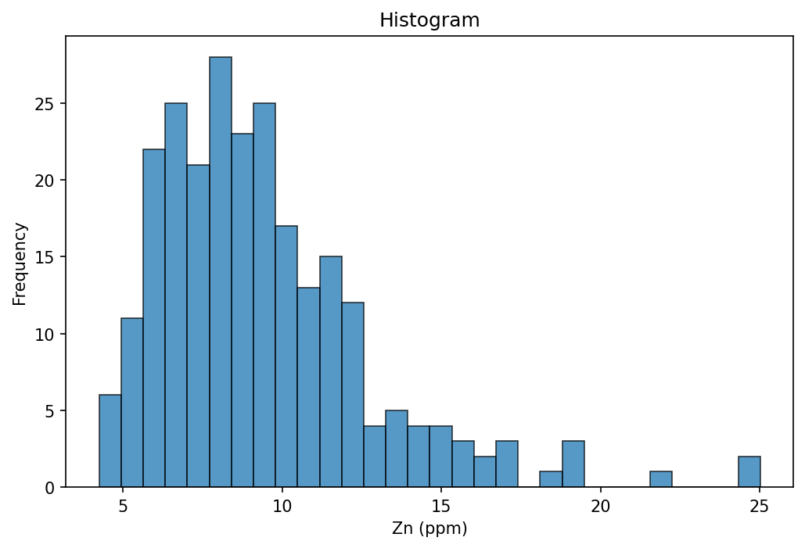
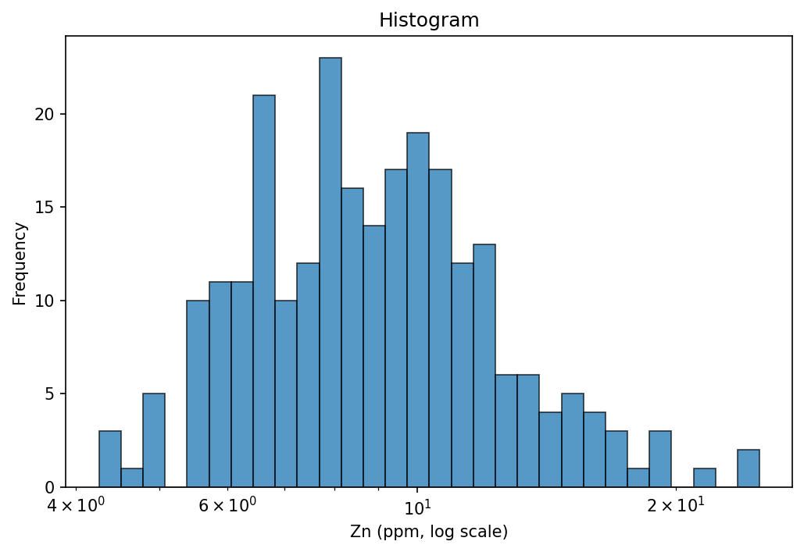
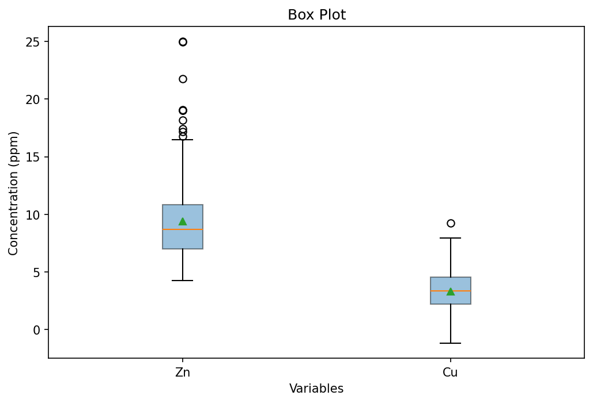
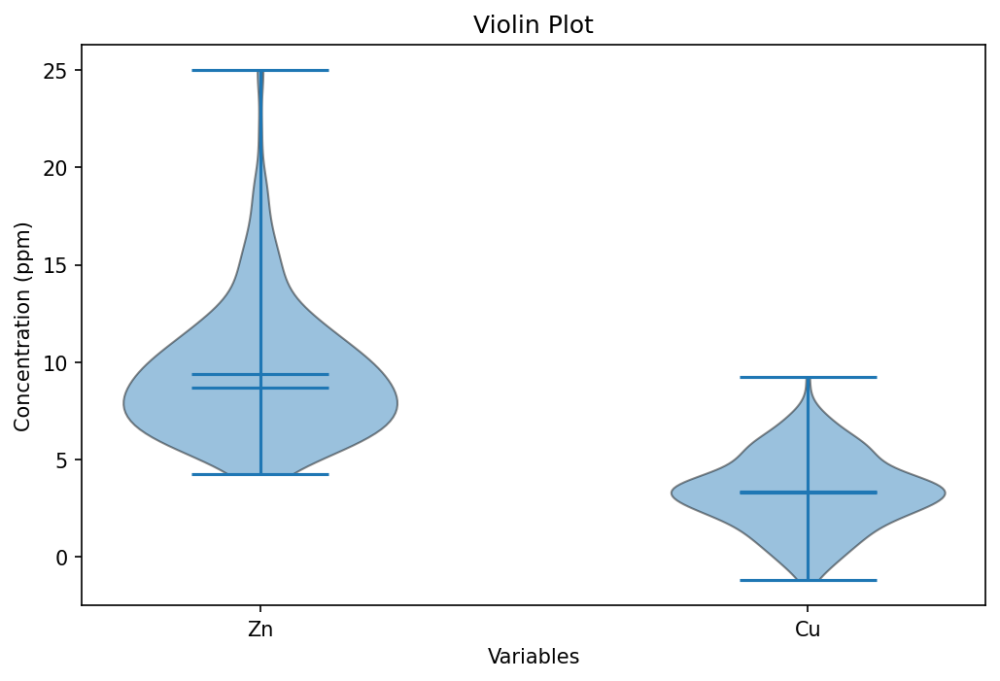
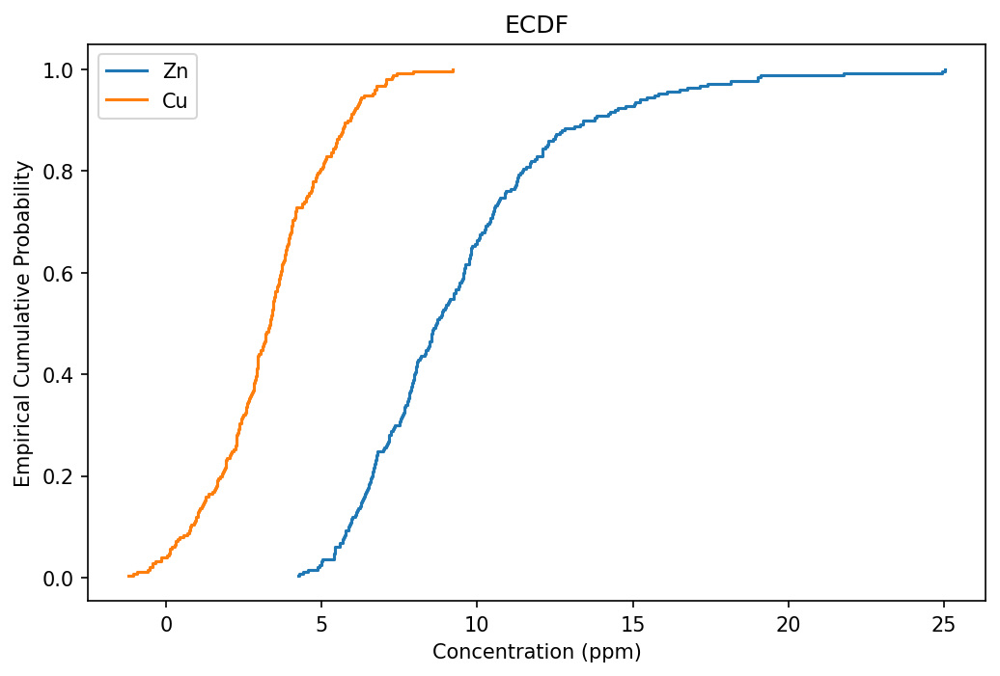
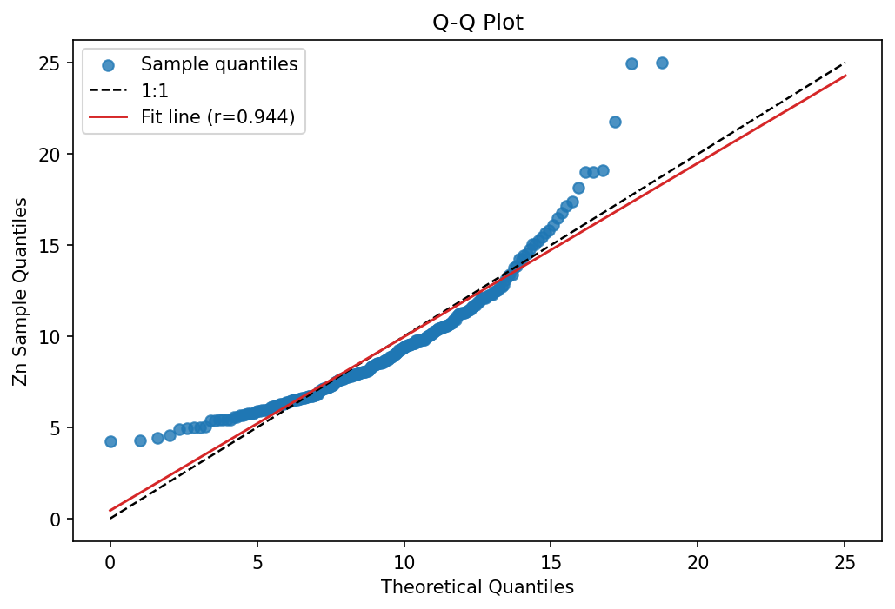
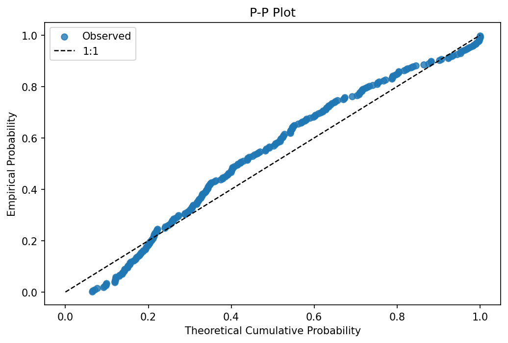
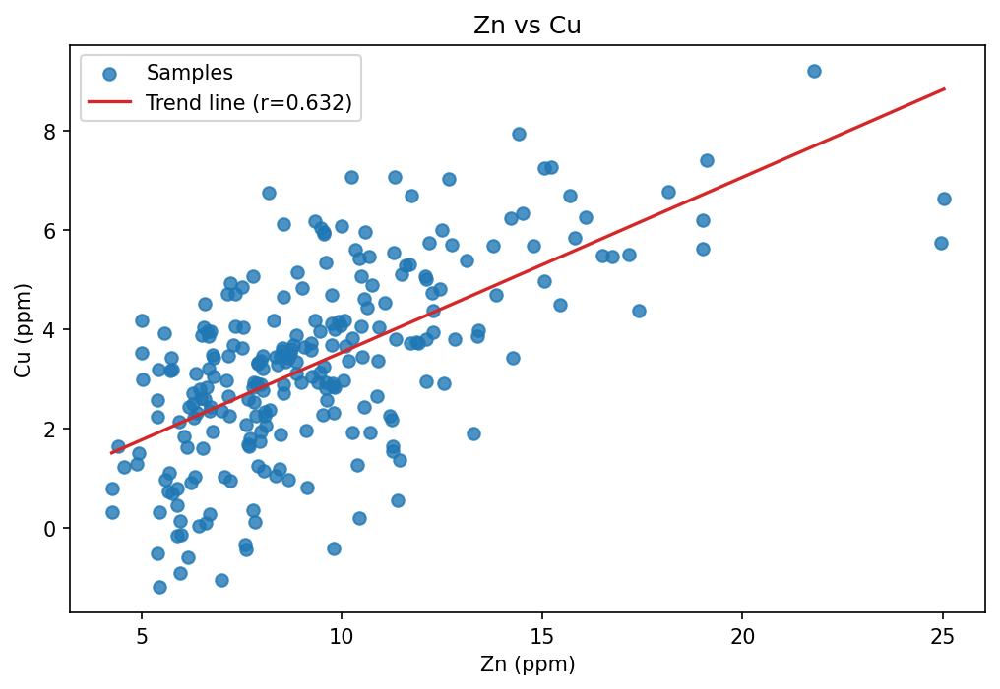

# Statistical Visualization

MinexPy includes a `minexpy.statviz` module for common statistical plots used in geoscience QA/QC and exploratory analysis.

## Available Plot Functions

- `plot_histogram`: Histogram with `linear` or `log` x-axis.
- `plot_box_violin`: Box or violin representation for one or multiple variables.
- `plot_ecdf`: Empirical cumulative distribution function.
- `plot_qq`: Quantile-quantile diagnostic against a theoretical distribution.
- `plot_pp`: Probability-probability diagnostic against a theoretical distribution.
- `plot_scatter`: Scatter plot with optional linear trend line.

All plot functions set axis labels and return `(figure, axis)` for further customization.

## `plot_histogram`

Create histograms in linear and log scale using the same Zn dataset:

```python
import matplotlib.pyplot as plt
import numpy as np
from minexpy.statviz import plot_histogram

rng = np.random.default_rng(42)
zn = rng.lognormal(mean=2.2, sigma=0.35, size=250)

fig, ax = plot_histogram(zn, bins=30, scale="linear", xlabel="Zn (ppm)")
plt.show()

fig, ax = plot_histogram(zn, bins=30, scale="log", xlabel="Zn (ppm, log scale)")
plt.show()
```




## `plot_box_violin`

Visualize Zn and Cu distributions as box and violin plots:

```python
import matplotlib.pyplot as plt
import numpy as np
from minexpy.statviz import plot_box_violin

rng = np.random.default_rng(42)
zn = rng.lognormal(mean=2.2, sigma=0.35, size=250)
cu = 0.35 * zn + rng.normal(0, 1.5, size=250)

fig, ax = plot_box_violin({"Zn": zn, "Cu": cu}, kind="box", ylabel="Concentration (ppm)")
plt.show()

fig, ax = plot_box_violin({"Zn": zn, "Cu": cu}, kind="violin", ylabel="Concentration (ppm)")
plt.show()
```




## `plot_ecdf`

Compare empirical cumulative distributions for Zn and Cu:

```python
import matplotlib.pyplot as plt
import numpy as np
from minexpy.statviz import plot_ecdf

rng = np.random.default_rng(42)
zn = rng.lognormal(mean=2.2, sigma=0.35, size=250)
cu = 0.35 * zn + rng.normal(0, 1.5, size=250)

fig, ax = plot_ecdf({"Zn": zn, "Cu": cu}, xlabel="Concentration (ppm)")
plt.show()
```



## `plot_qq`

Check Zn sample quantiles against a normal reference:

```python
import matplotlib.pyplot as plt
import numpy as np
from minexpy.statviz import plot_qq

rng = np.random.default_rng(42)
zn = rng.lognormal(mean=2.2, sigma=0.35, size=250)

fig, ax = plot_qq(zn, distribution="norm", ylabel="Zn Sample Quantiles")
plt.show()
```



## `plot_pp`

Compare empirical vs theoretical cumulative probabilities:

```python
import matplotlib.pyplot as plt
import numpy as np
from minexpy.statviz import plot_pp

rng = np.random.default_rng(42)
zn = rng.lognormal(mean=2.2, sigma=0.35, size=250)

fig, ax = plot_pp(zn, distribution="norm", ylabel="Empirical Probability")
plt.show()
```



## `plot_scatter`

Plot bivariate Zn-Cu relation with a fitted trend line:

```python
import matplotlib.pyplot as plt
import numpy as np
from minexpy.statviz import plot_scatter

rng = np.random.default_rng(42)
zn = rng.lognormal(mean=2.2, sigma=0.35, size=250)
cu = 0.35 * zn + rng.normal(0, 1.5, size=250)

fig, ax = plot_scatter(
    zn,
    cu,
    add_trendline=True,
    xlabel="Zn (ppm)",
    ylabel="Cu (ppm)",
    title="Zn vs Cu",
)
plt.show()
```


